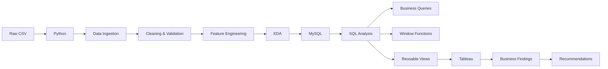

# Superstore Sales, Profitability & Customer Analytics


🌐 **Data Blog:** [bloomindata.in](https://bloomindata.in/)


An end-to-end retail analytics project analyzing **sales performance, profitability, discount impact, geographic performance, customer value, and growth trends** using Python, MySQL, SQL, and Tableau.

> **Business Question:** Where is the business making money, where is it losing money, and why?

---

## Table of Contents

1. [Project Overview](#1-project-overview)
2. [Business Problem](#2-business-problem)
3. [Dataset](#3-dataset)
4. [Tech Stack](#4-tech-stack)
5. [Project Workflow](#5-project-workflow)
6. [Project Structure](#6-project-structure)
7. [Setup & Installation](#7-setup--installation)
8. [How to Run](#8-how-to-run)
9. [Data Cleaning & Feature Engineering](#9-data-cleaning--feature-engineering)
10. [SQL Analysis](#10-sql-analysis)
11. [Tableau Dashboards](#11-tableau-dashboards)
12. [Key Findings](#12-key-findings)
13. [Business Recommendations](#13-business-recommendations)
14. [Limitations](#14-limitations)
15. [Future Improvements](#15-future-improvements)
16. [Skills Demonstrated](#16-skills-demonstrated)
17. [Author](#17-author)

---

# 1. Project Overview

| Metric              |                           Value |
| ------------------- | ------------------------------: |
| Project Type        | Self-directed portfolio project |
| Domain              |           Multi-category retail |
| Analysis Period     |                       2014–2017 |
| Total Orders        |                           5,009 |
| Customers           |                             793 |
| Total Sales         |                   $2,297,200.86 |
| Total Profit        |                     $286,397.02 |
| Profit Margin       |                          12.47% |
| Average Order Value |                         $458.61 |
| Dashboards          |                               5 |

The project follows a complete analytics pipeline:

**Python → MySQL → SQL → Tableau**

---

# 2. Business Problem

The project was designed to answer five business questions:

1. **Where is the company generating revenue?**
2. **Where is it making or losing money?**
3. **Are discounts reducing profitability?**
4. **Is the business growing profitably over time?**
5. **Which customers are valuable, loyal, at risk, or lost?**

### Success Criteria

Every major finding should be:

* Quantified in financial terms
* Connected to an actionable business implication
* Interpreted with appropriate statistical limitations

---

# 3. Dataset

### Source

**Sample Superstore Dataset**

### Dataset Details

| Attribute        | Details                   |
| ---------------- | ------------------------- |
| Rows             | 9,994                     |
| Original Columns | 21                        |
| Date Range       | 2014–2017                 |
| Customers        | 793                       |
| Encoding         | Windows-1252 (`cp1252`)   |
| File             | `Sample - Superstore.csv` |

### Key Columns

```text
Order Date
Ship Date
Customer ID
Customer Name
Segment
Region
State
City
Category
Sub-Category
Product Name
Sales
Quantity
Discount
Profit
```

### Data Quality

* 0 duplicate records
* 0 null values found during validation
* Negative profit values retained because they represent genuine business losses

### Dataset Limitation

The dataset does not contain **product cost** or **shipping cost** fields. Therefore, profitability analysis relies on the provided `Profit` column.

---

# 4. Tech Stack

| Technology               | Purpose                                             |
| ------------------------ | --------------------------------------------------- |
| **Python / Pandas**      | Data cleaning, validation, feature engineering, EDA |
| **MySQL**                | Relational data storage                             |
| **SQLAlchemy**           | Python-to-MySQL connection                          |
| **SQL**                  | Business analysis and reusable views                |
| **Tableau Public**       | Interactive dashboards                              |
| **Matplotlib / Seaborn** | Exploratory analysis                                |

---

# 5. Project Workflow



### Pipeline

```text
Raw CSV
   ↓
Python
   ├── Ingestion
   ├── Cleaning
   ├── Validation
   ├── Feature Engineering
   └── EDA
   ↓
MySQL
   ↓
SQL
   ├── Business Queries
   ├── Window Functions
   └── Analytical Views
   ↓
Tableau
   ↓
Insights & Recommendations
```

---

# 6. Project Structure

```text
superstore-analytics/
│
├── data/
│   ├── Sample - Superstore.csv
│   └── data_raw.csv
│
├── python/
│   ├── 01_data_ingestion.py
│   ├── 02_data_cleaning.py
│   ├── 03_feature_engineering.py
│   ├── 04_eda_category_analysis.py
│   ├── 05_eda_discount_analysis.py
│   ├── 06_eda_geographic_analysis.py
│   ├── 07_rfm_segmentation.py
│   ├── 08_time_series_analysis.py
│   ├── 09_mysql_upload.py
│   ├── 10_tableau_export.py
│   ├── 11_correlation_analysis.py
│   ├── 12_quadrant_data_prep.py
│   └── 13_extended_analysis.py
│
├── sql/
│   ├── 01_database_setup.sql
│   ├── 02_table_creation.sql
│   ├── 03_sales_performance_queries.sql
│   ├── 04_product_profitability_queries.sql
│   ├── 05_discount_analysis_queries.sql
│   ├── 06_geographic_queries.sql
│   ├── 07_customer_rfm_queries.sql
│   ├── 08_window_functions.sql
│   └── 09_create_views.sql
│
├── tableau/
│   ├── superstore_dashboard.twbx
│   └── exports/
│
├── docs/
│   ├── case_study.md
│   └── dashboard_screenshots/
│
└── README.md
```

---

# 7. Setup & Installation

## Prerequisites

* Python 3.9+
* MySQL 8.0+
* Tableau Public or Tableau Desktop

## Clone Repository

```bash
git clone https://github.com/<your-username>/superstore-analytics.git
cd superstore-analytics
```

## Install Python Dependencies

```bash
pip install pandas sqlalchemy pymysql matplotlib seaborn
```

## Create MySQL Database

```sql
CREATE DATABASE superstore;
```

## Configure Database Connection

Update:

```text
python/09_mysql_upload.py
```

Example:

```python
from sqlalchemy import create_engine

engine = create_engine(
    "mysql+pymysql://root:<your_password>@localhost:3306/superstore"
)
```

## Add Dataset

Place the raw dataset at:

```text
data/Sample - Superstore.csv
```

---

# 8. How to Run

## Step 1 — Run Python Scripts

```bash
python python/01_data_ingestion.py
python python/02_data_cleaning.py
python python/03_feature_engineering.py
python python/04_eda_category_analysis.py
python python/05_eda_discount_analysis.py
python python/06_eda_geographic_analysis.py
python python/07_rfm_segmentation.py
python python/08_time_series_analysis.py
python python/09_mysql_upload.py
python python/10_tableau_export.py
```

Additional analysis:

```bash
python python/11_correlation_analysis.py
python python/12_quadrant_data_prep.py
python python/13_extended_analysis.py
```

## Step 2 — Run SQL

```sql
SOURCE sql/01_database_setup.sql;
SOURCE sql/02_table_creation.sql;
SOURCE sql/09_create_views.sql;
```

Individual analysis queries can then be executed as required.

## Step 3 — Open Tableau

Open:

```text
tableau/superstore_dashboard.twbx
```

or connect Tableau to the exported files in:

```text
tableau/exports/
```

---

# 9. Data Cleaning & Feature Engineering

## Data Cleaning

### Encoding

The raw CSV uses Windows-1252 encoding.

It was loaded using:

```python
pd.read_csv(
    "Sample - Superstore.csv",
    encoding="cp1252"
)
```

The cleaned dataset was then saved as UTF-8.

### Validation

The dataset was explicitly checked for:

```text
Duplicates → 0
Nulls      → 0
```

### Negative Profit

Negative profit values were retained because they represent actual business losses rather than data errors.

---

## Feature Engineering

The project expanded the dataset with analytical features for profitability, discount analysis, time trends, and customer segmentation.

| Feature          | Logic                    | Purpose                      |
| ---------------- | ------------------------ | ---------------------------- |
| Profit Margin %  | `Profit / Sales × 100`   | Normalize profitability      |
| Discount Buckets | Discount ranges          | Identify discount thresholds |
| Recency          | Days since last order    | RFM analysis                 |
| Frequency        | Number of orders         | RFM analysis                 |
| Monetary         | Total sales per customer | Customer value               |
| RFM Segment      | R/F/M scoring            | Customer segmentation        |

### RFM Segments

```text
Champions
Loyal
Recent
At Risk
Lost
```

---

# 10. SQL Analysis

The SQL layer transforms cleaned data into reusable business analysis.

### SQL Techniques

```text
SELECT
WHERE
GROUP BY
HAVING
ORDER BY
CASE
JOIN
CTEs
RANK()
LAG()
SUM() OVER()
```

### Analytical Views

| View                          | Purpose                                |
| ----------------------------- | -------------------------------------- |
| `vw_sales_performance`        | Sales KPIs by time and category        |
| `vw_product_profitability`    | Product and sub-category profitability |
| `vw_discount_analysis`        | Discount vs. margin                    |
| `vw_geographic_profitability` | Region, state and city performance     |
| `vw_monthly_performance`      | Monthly and YoY trends                 |
| `vw_customer_rfm`             | Customer RFM scores and segments       |

---

# 11. Tableau Dashboards

Five interactive dashboards were created.

| Dashboard                       | Business Question                                |
| ------------------------------- | ------------------------------------------------ |
| **Executive Overview**          | Are we growing profitably?                       |
| **Product & Sales Performance** | Which products drive revenue and profit?         |
| **Discount & Margin**           | Where is discounting hurting profitability?      |
| **Geographic Performance**      | Where is the business performing geographically? |
| **Customer & Growth**           | Which customers are valuable and at risk?        |

### Dashboard Components

**Executive Overview**

* Total Sales
* Profit Margin
* Orders
* AOV
* Monthly/yearly trends
* Category and regional performance

**Product & Sales Performance**

* Sub-category rankings
* Top products
* Sales vs. profit matrix

**Discount & Margin**

* Discount buckets
* Margin analysis
* Sales-profit quadrant
* Loss-making sub-categories

**Geographic Performance**

* Region comparison
* State-level analysis
* City performance
* Geographic map

**Customer & Growth**

* RFM segments
* Customer value
* Loyal customers
* At-Risk customers

**Tableau Public:** `[Add Tableau Link]`

---

# 12. Key Findings

## 12.1 Discount vs. Profitability

Pearson correlation between discount and profit margin:

**-0.864**

Average profit margin:

| Discount |   Margin |
| -------- | -------: |
| 0%       |   29.51% |
| 21–30%   | Negative |
| 50%+     | -119.20% |

However, correlation does not establish causation.

**Binders** had an average discount of **37.23%** while still generating **$30,221.76 profit**, showing that discount level alone does not determine profitability.

---

## 12.2 Product Profitability

**Tables** generated:

| Metric           |       Value |
| ---------------- | ----------: |
| Sales            | $206,965.53 |
| Profit           | -$17,725.48 |
| Average Discount |      26.13% |

---

## 12.3 Geographic Performance

| Region  |      Profit |
| ------- | ----------: |
| West    | $108,418.45 |
| Central |  $39,706.36 |

The sales-profit quadrant analysis identifies geographic areas with relatively high sales but weaker profitability.

---

## 12.4 Customer Value

Across 793 RFM-segmented customers:

| Segment | Customers | Historical Sales |
| ------- | --------: | ---------------: |
| Loyal   |       211 |      $716,805.46 |
| Lost    |       297 |      $550,543.60 |
| At Risk |        90 |      $309,501.64 |

This shows that customer count and customer economic value are not necessarily aligned.

---

## 12.5 Growth & Profitability

Profit margin:

| Year | Profit Margin |
| ---- | ------------: |
| 2014 |        10.23% |
| 2016 |        13.43% |
| 2017 |        12.74% |

Sales increased **20.36% in 2017**, while AOV declined despite an increase in order volume.

---

# 13. Business Recommendations

1. Move from blanket discounting to **product-specific discount limits**.
2. Investigate **Tables at SKU level** to identify the drivers of losses.
3. Investigate what is contributing to the **West vs. Central profitability gap**.
4. Develop a targeted reactivation strategy for the **90 At-Risk customers**.
5. Monitor **sales growth alongside profit and margin**.

---

# 14. Limitations

* No product cost or shipping cost fields.
* Profitability analysis relies on the provided `Profit` column.
* Discount-profit correlation does not prove causation.
* RFM segmentation is descriptive, not predictive.
* Tableau Public required a CSV-extract workflow.
* Dataset ends in 2017; findings do not represent current business conditions.

---

# 15. Future Improvements

* Cohort-based customer retention analysis
* Churn prediction using RFM and behavioral features
* Product cost and shipping cost analysis
* Automated SQL and Python data refresh
* A/B testing of discount caps
* Interactive discount scenario analysis

---

# 16. Skills Demonstrated

### Python

* Pandas
* Data cleaning and validation
* Feature engineering
* Exploratory data analysis
* Correlation analysis
* RFM segmentation

### SQL

* Aggregations
* Joins
* CASE statements
* CTEs
* Window functions
* Analytical views

### Database

* MySQL
* Schema design
* SQLAlchemy
* Python-to-database integration

### Tableau

* Interactive dashboards
* Calculated fields
* LOD expressions
* Parameters
* Dashboard actions
* Data relationships

### Analytical Skills

* Business problem framing
* Profitability analysis
* Customer segmentation
* Statistical interpretation
* Correlation vs. causation
* Translating analysis into business recommendations

---

# 17. Author

**Priyanka Lakra**
Data Analyst

[Portfolio](https://bloomindata.in/) · [LinkedIn](#) · [GitHub](#)
